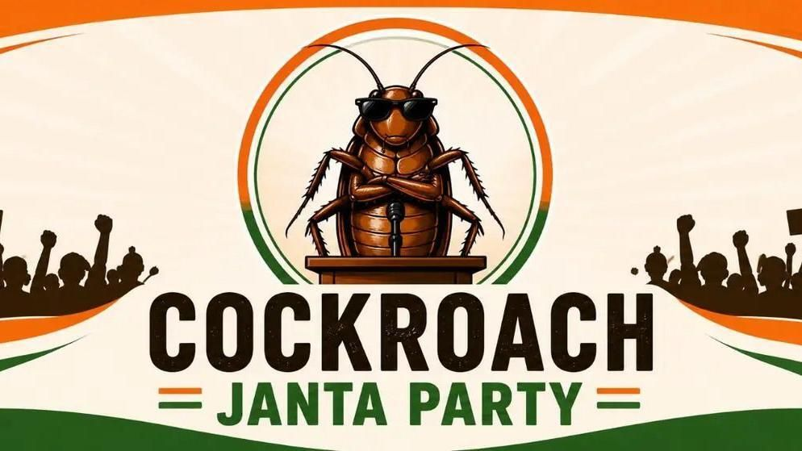

<p align="center">
  
</p>

<h1 align="center">Cockroach Janta Party</h1>
<h3 align="center">An Archive of the Biggest Movement in Independent India's History</h3>

<p align="center"><em>May 15, 2026 to July 25, 2026 &middot; 71 days</em></p>

---

It started with an insult.

On May 15, 2026, the Chief Justice of the Supreme Court called India's unemployed youth "cockroaches" and "parasites of society." He said it from the highest bench of the land. He meant it as a dismissal. He got a revolution instead.

The Cockroach Janta Party was born within twenty-four hours. It grew into the largest sustained, peaceful, youth-led uprising this country has ever seen. Mainstream television refused to cover it. The state tried to censor its X account under Section 69A of the IT Act. The Delhi High Court restored it. A blue ink attack turned into a slogan. A Bollywood dancer's tear-streaked Instagram video did what a hundred anchor debates would not. In the end, a Union Minister of Education resigned.

Seventy-one days. Twenty-one young lives lost to NEET paper leaks before the country was forced to look. Sixteen million followers who had never marched before. Parents shielding their own children from lathis at the campsite. Hunger strikers who kept fasting after the ink was thrown, after the barricades went up, after the cameras left.

By the afternoon of July 25, 2026, the youth of India had won.

**This repository is an act of remembering.**

I built it because algorithms bury what matters. Because ten years from now, when a school student asks "how did they actually win," they should find more than a Wikipedia stub. They should find the specific days. The specific quotes. The specific names. The specific faces. The exact tweets, the exact photographs, the exact hunger strikers who wouldn't leave the concrete of Jantar Mantar until they had accountability.

We are not here to relitigate history. We are here to make sure it cannot be quietly forgotten.

## Contribute

If you were there, or if you have something worth preserving:

- Drop protest photos into [`images/protests/`](images/protests/)
- Drop meme-worthy slogans and images into [`images/memes/`](images/memes/)
- Commit and push to `main`

Your contribution goes live within about a minute. Vercel rebuilds the site automatically on every push.

## Local development

```bash
python3 generate_timeline_site.py
open index.html
```

That's it. No dependencies, no build tools, no framework. Just Python's standard library and a static HTML file.

## Repository layout

- `generate_timeline_site.py` builds `index.html` from the timeline data and scans the gallery folders
- `images/` holds site imagery: figures, the CJP logo, the community gallery
- `vercel.json` configures Vercel to run the Python script on every deploy
- `.gitignore` keeps the generated `index.html` out of git; Vercel rebuilds it fresh

---

<p align="center"><strong>Long live the cockroach. Long live the Constitution.</strong></p>
<p align="center"><em>Samvidhan Zindabad.</em></p>
